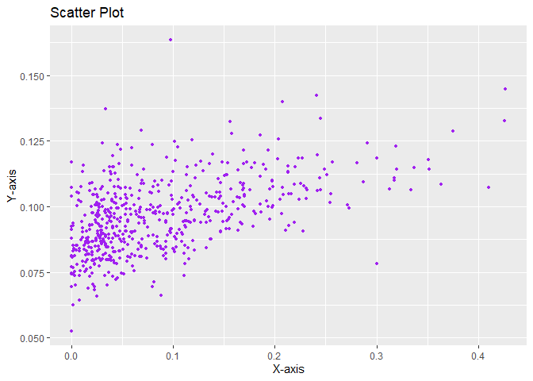

scatter_plot
================
Andras Szeitz

``` r
options(repos = c(CRAN = "https://cran.rstudio.com"))
```

``` r
install.packages("devtools")
```

    ## Installing package into 'C:/Users/My Dell/AppData/Local/R/win-library/4.3'
    ## (as 'lib' is unspecified)

    ## package 'devtools' successfully unpacked and MD5 sums checked
    ## 
    ## The downloaded binary packages are in
    ##  C:\Users\My Dell\AppData\Local\Temp\RtmpE3N7QC\downloaded_packages

``` r
install.packages("usethis")
```

    ## Installing package into 'C:/Users/My Dell/AppData/Local/R/win-library/4.3'
    ## (as 'lib' is unspecified)

    ## package 'usethis' successfully unpacked and MD5 sums checked
    ## 
    ## The downloaded binary packages are in
    ##  C:\Users\My Dell\AppData\Local\Temp\RtmpE3N7QC\downloaded_packages

Load a couple of packages

``` r
library(devtools)
```

    ## Loading required package: usethis

``` r
library(usethis)
```

``` r
devtools::install_github("stat545ubc-2023/AssignmentB2AS", force = TRUE)
```

    ## Downloading GitHub repo stat545ubc-2023/AssignmentB2AS@HEAD

    ## 
    ## ── R CMD build ─────────────────────────────────────────────────────────────────
    ##          checking for file 'C:\Users\My Dell\AppData\Local\Temp\RtmpE3N7QC\remotes1f546719497a\stat545ubc-2023-AssignmentB2AS-9a190c0/DESCRIPTION' ...  ✔  checking for file 'C:\Users\My Dell\AppData\Local\Temp\RtmpE3N7QC\remotes1f546719497a\stat545ubc-2023-AssignmentB2AS-9a190c0/DESCRIPTION'
    ##       ─  preparing 'AssignmentB2AS':
    ##    checking DESCRIPTION meta-information ...     checking DESCRIPTION meta-information ...   ✔  checking DESCRIPTION meta-information
    ##       ─  checking for LF line-endings in source and make files and shell scripts
    ##   ─  checking for empty or unneeded directories
    ##   ─  building 'AssignmentB2AS_0.1.0.tar.gz'
    ##      
    ## 

    ## Installing package into 'C:/Users/My Dell/AppData/Local/R/win-library/4.3'
    ## (as 'lib' is unspecified)

Load more packages

``` r
#loading libraries 
library(datateachr)
library(tidyverse)
```

    ## ── Attaching core tidyverse packages ──────────────────────── tidyverse 2.0.0 ──
    ## ✔ dplyr     1.1.3     ✔ readr     2.1.4
    ## ✔ forcats   1.0.0     ✔ stringr   1.5.0
    ## ✔ ggplot2   3.4.4     ✔ tibble    3.2.1
    ## ✔ lubridate 1.9.3     ✔ tidyr     1.3.0
    ## ✔ purrr     1.0.2     
    ## ── Conflicts ────────────────────────────────────────── tidyverse_conflicts() ──
    ## ✖ dplyr::filter() masks stats::filter()
    ## ✖ dplyr::lag()    masks stats::lag()
    ## ℹ Use the conflicted package (<http://conflicted.r-lib.org/>) to force all conflicts to become errors

``` r
library(ggplot2)
library(testthat)
```

    ## 
    ## Attaching package: 'testthat'
    ## 
    ## The following object is masked from 'package:dplyr':
    ## 
    ##     matches
    ## 
    ## The following object is masked from 'package:purrr':
    ## 
    ##     is_null
    ## 
    ## The following objects are masked from 'package:readr':
    ## 
    ##     edition_get, local_edition
    ## 
    ## The following object is masked from 'package:tidyr':
    ## 
    ##     matches
    ## 
    ## The following object is masked from 'package:devtools':
    ## 
    ##     test_file

``` r
library(rlang)
```

    ## 
    ## Attaching package: 'rlang'
    ## 
    ## The following objects are masked from 'package:testthat':
    ## 
    ##     is_false, is_null, is_true
    ## 
    ## The following objects are masked from 'package:purrr':
    ## 
    ##     %@%, flatten, flatten_chr, flatten_dbl, flatten_int, flatten_lgl,
    ##     flatten_raw, invoke, splice

``` r
library(lifecycle)
library(utf8)
library(fansi)
```

# Make a scatter plot

``` r
#I wrote a function using the cancer_sample dataset from mda deliverable 1 to generate a scatter plot.

library(datateachr)
library(ggplot2)
scatter_plot <- function(x, y, x_label = "X-axis", y_label = "Y-axis", title = "Scatter Plot") {
  plot_data <- data.frame(x = x, y = y)
  
  # Suppressing warnings while creating the plot
  suppressWarnings({
    scatter_plot <- ggplot(plot_data, aes(x = x, y = y)) +
      geom_point(size = 1, color = "purple") +
      labs(x = x_label, y = y_label, title = title)
  })
  
  # Printing the scatter plot
  print(scatter_plot)
}

# Your scatter plot code here
scatter_plot(x = cancer_sample$concavity_mean, y = cancer_sample$smoothness_mean)
```

<!-- -->
